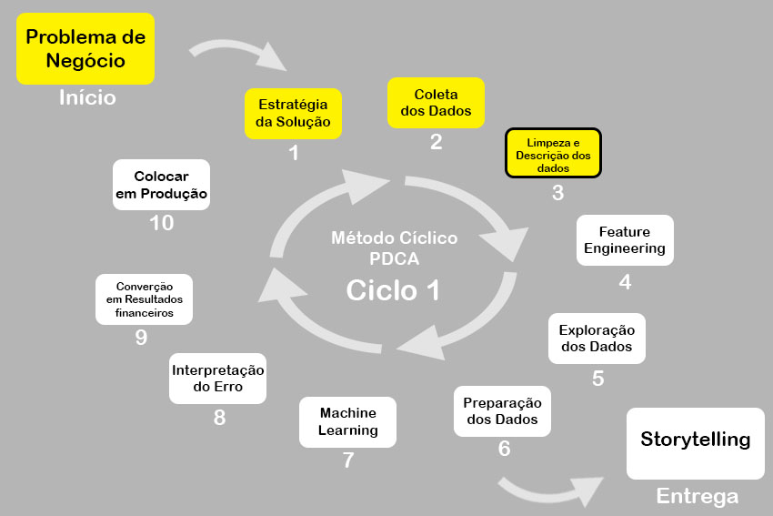

# Olá, seja bem vindo ao meu diretório. Para acessar o pipeline do projeto, clique na pasta "notebooks" e em seguida no arquivo "notebook.ipynb" :smiley:
# SCORE ALL CONSULTING

### Predicting Credit Score Classification
# 1.0 Business Problem
# 2.0 Planejamento da Solução
## 2.1 Inputs
## 2.2 Outputs
# 3.0 Requisitos
# 4.0 Premissas
# 5.0 Top 3 Data Insights
# 6.0 Machine Learning Aplicado
# 7.0 Machine Learning Performance
# 8.0 Resultados Financeiros
# 9.0 Deploy do Modelo em Produção
# 10.0 Lições Aprendidas
# 11.0 Próximos Passos
# 12.0 Status do Projeto

# 13.0 Sumário
* ID : Identificação única da entrada
* Customer_ID : Identificação única da pessoa
* Month : Mês do ano
* Name : Nome de pessoa
* Age : Idade da pessoa
* SSN : Segurança social da pessoa
* Occupation : Profissão da pessoa
* Annual_Income : Renda anual da pessoa
* Monthly_Inhand_Salary : Salário base mensal da pessoa
* Num_Bank_Accounts : Número de contas bancárias que a pessoa possui
* Num_Credit_Card : Número de outros cartões de crédito detidos pela pessoa
* Interest_Rate : Taxa de juros do cartão de crédito
* Num_of_Loan : Número de empréstimos tomados do banco
* Type_of_Loan : Tipos de empréstimo tomados pela pessoa
* Delay_from_due_date : Número médio de dias atrasados ​​a partir da data de pagamento
* Num_of_Delayed_Payment : Número médio de pagamentos atrasados ​​pela pessoa
* Changed_Credit_Limit : Variação percentual no limite do cartão de crédito
* Num_Credit_Inquiries : Número de consultas de cartão de crédito
* Credit_Mix : Classificação do mix de créditos
* Outstanding_Debt : Dívida restante a ser paga (em USD)
* Credit_Utilization_Ratio : Taxa de utilização do cartão de crédito
* Credit_History_Age : Idade do histórico de crédito da pessoa
* Payment_of_Min_Amount : Se apenas o valor mínimo foi pago pela pessoa
* Total_EMI_per_month : Pagamentos mensais do EMI (EMI = valor principal + juros pagos sobre o empréstimo, em USD)
* Amount_invested_monthly : Valor mensal investido pelo cliente (em USD)
* Payment_Behaviour : Comportamento de pagamento do cliente (em USD)
* Monthly_Balance : Valor do saldo mensal do cliente (em USD)
